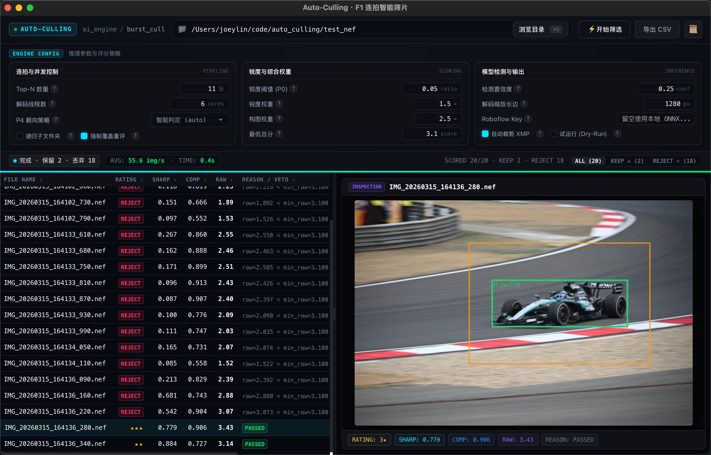

<p align="center">
  
</p>

# Auto Culling

**English** | [中文版](README_zh.md)

Automated culling for F1 & motorsport photography. Point it at a card straight off the
camera: it groups burst sequences, scores every frame with a multi-stage AI pipeline,
keeps the best shots per burst, and writes Lightroom-compatible star ratings, reject
flags and auto-crops — no manual triage required.



- **Input**: a folder straight off the camera — Sony ARW, Nikon NEF, Canon CR2/CR3,
  Fuji RAF, Olympus ORF, Panasonic RW2, HEIF (`.hif/.heif/.heic`), JPEG, PNG, TIFF
- **Output**: `.xmp` sidecars (RAW/HEIF) or in-file XMP (JPEG) with star ratings,
  reject flags and crop parameters
- **Runtime**: ONNX Runtime only, no PyTorch. GPU acceleration is automatic
  (CoreML on Apple Silicon, DirectML/CUDA on Windows) with CPU fallback everywhere.

## Quick Start

### Standalone executable (no Python needed)

Grab a prebuilt binary from [GitHub Releases](https://github.com/Au3C2/AutoCullingF1/releases):

```powershell
# Windows
.\auto_cull_v0.2_win_x64.exe --input-dir C:\Photos\F1 --recursive --force
```

```bash
# macOS (Apple Silicon)
./auto_cull_v0.2_macos_arm64 --input-dir /path/to/photos --recursive --force
```

The binary bundles the ONNX models and exiftool — nothing else to install. Omit
`--input-dir` to open a folder picker. Files that already carry ratings are skipped
unless `--force`.

### From source

Prerequisites: Python 3.10+ with [uv](https://github.com/astral-sh/uv), and ffmpeg on
PATH (`brew install ffmpeg`; Windows: vendored under `external/ffmpeg/`).

```bash
uv sync
source .venv/bin/activate        # Windows: .venv\Scripts\activate
python cull_photos.py --input-dir /path/to/photos --recursive --force
```

Omitting `--input-dir` opens a small GUI (customtkinter) instead.

### Useful options

| Option | Meaning |
| :--- | :--- |
| `--workers N` | Decode-pool size (default 8; ratings are worker-invariant) |
| `--top-n 11` | Max keepers per burst group |
| `--scale-width 1280` | Decode resolution for the scoring chain |
| `--p4-policy` | `always` (default) / `never` / `auto` (F1/GP folders only) |
| `--crop-off` | Disable auto-crop writing |
| `--dry-run` | Score and report without writing any metadata |
| `--dump-scores FILE` | Export per-image CSV (sharp/comp/raw/rating) |
| `--force` | Re-analyze files that already carry ratings |
| `--deterministic` | Bit-identical cross-platform CPU path (slower) |

## How it works

1. **Burst grouping** — frames are grouped by EXIF capture time, with a time-gap
   fallback when EXIF is unavailable.
2. **Per-frame scoring** —
   - **Sharpness**: FFT-based high-frequency energy with subject-ROI weighting;
     out-of-focus frames are rejected outright.
   - **Composition**: an F1-specific YOLO model (COCO `yolov8n` cascade fallback)
     scores subject size, placement and lead room.
   - **Orientation & integrity**: a compact classifier rejects rear-view shots and
     penalizes cut-off / occluded subjects.
3. **Top-N selection** — the best *N* frames per burst (default 11) keep their stars;
   the rest of the group is downgraded.
4. **Auto-crop** — a Lightroom crop around the detected subject (3:2 / 2:3) is written
   next to the rating.

A frame is auto-rejected (−1) when no subject is detected, the frame is out of focus,
the car is seen from the rear, or its score falls below the keep floor. The exact
weights and thresholds live in `cull/scorer.py` and are locked against the committed
deterministic truth in `tests/baselines/`.

## Performance

Gate protocol (~500 real camera files per format, steady state):

**macOS — Apple M4, workers = 4**

| JPEG | HEIF | Sony ARW | Nikon NEF |
| ---: | ---: | ---: | ---: |
| 83.5 img/s | 65.5 img/s | 49.9 img/s | 70.0 img/s |

**Windows** — Ryzen 7 5700X + RTX 4070 Ti, default workers = 8: 35–46 img/s across
formats.

Benchmark methodology, per-platform baselines and the optimization history live in
[`results/performance_baseline.md`](results/performance_baseline.md).

## For developers

```text
cull/           core engine: decode, burst grouping, detection, scoring, XMP write, GUI
models/         ONNX weights
train/          training pipelines (YOLO fine-tune, P4 multi-task, fence classifier)
packaging/      PyInstaller build + unified regression suite (guards.py)
benchmarks/     per-format steady-state perf gate
tests/          precision gates, deterministic truth, CI harness
scripts/ eval/ docs/ results/    tooling, labeling guides, baseline records
external/       vendored exiftool (+ ffmpeg on Windows)
```

Regression gates:

```bash
pytest tests/ -m deterministic                        # cross-platform truth (strict)
pytest tests/test_cull.py tests/test_precision_heif.py tests/test_precision_raw.py
python packaging/guards.py    # precision → perf → build → packaged gates, ~15 min
```

CI (`.github/workflows/`) runs the same gates on GitHub-hosted macOS/Windows runners
from committed seed samples. To build the standalone binaries:

```bash
uv pip install pyinstaller
python packaging/build.py            # onefile
python packaging/build.py --onedir   # recommended: no per-launch extraction tax
```

Further reading: [`results/performance_baseline.md`](results/performance_baseline.md)
(measured numbers, platform baselines), [`docs/P4_LABELING.md`](docs/P4_LABELING.md)
(P4 labeling guide).

## License

Licensed under the [Apache License 2.0](LICENSE).
